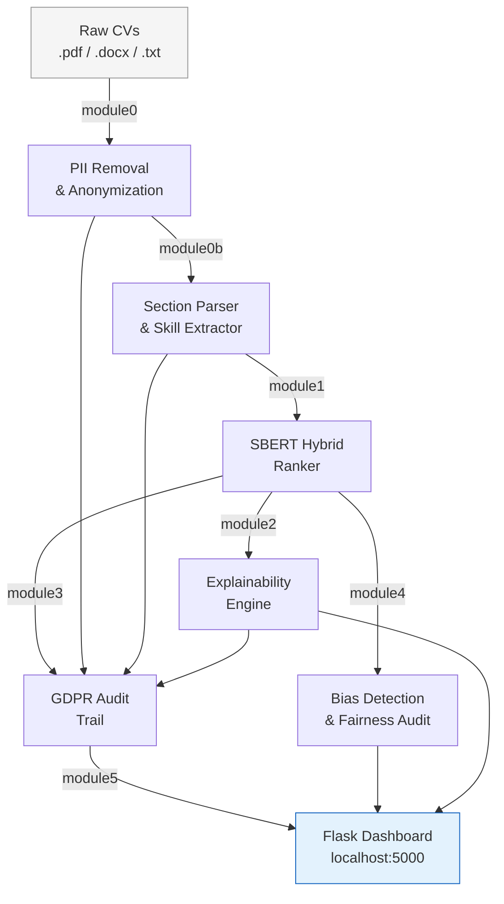

# Bias-Free Hiring Pipeline

[](https://www.python.org/downloads/)
[](LICENSE)
[](#gdpr--compliance)

An end-to-end, bias-aware recruitment pipeline that **anonymises CVs**, **ranks candidates** against a Job Description using SBERT semantic search, **explains every decision** in plain English, and logs a **GDPR-compliant, tamper-evident audit trail** — all surfaced through a clean Flask dashboard.

> Built as a professional placement portfolio project demonstrating NLP, MLOps, GDPR engineering, and cloud-native Python.

---

## Architecture



### Data flow at a glance

| Stage | Module | Input | Output |
|-------|--------|-------|--------|
| 0 | `module0` | `raw_cvs/*.pdf/docx/txt` | `anonymized_cvs/` + `vault/` |
| 0b | `module0b` | `anonymized_cvs/*.txt` | `parsed/*.json` |
| 1 | `module1` | `anonymized_cvs/` + `jd.txt` | `ranking_report.txt` |
| 2 | `module2` | ranking details + `parsed/` | `explanations/*.json` |
| 3 | `module3` | all stage outputs | `audit/audit_log.json` + report |
| 4 | `module4` | ranking details + `parsed/` | `audit/bias_*.json/txt` |
| 5 | `module5` | all outputs | `http://localhost:5000` |

---

## Tech Stack

| Layer | Technology |
|-------|-----------|
| NLP / NER | spaCy `en_core_web_trf` (transformer) |
| Semantic ranking | `sentence-transformers` — `all-MiniLM-L6-v2` |
| CV parsing | PyPDF2 · python-docx · pytesseract (OCR fallback) |
| Skill extraction | Taxonomy (481 skills) + optional KeyBERT |
| Bias detection | Pure-Python statistical checks (Pearson r, score compression) |
| Web dashboard | Flask 3 + Server-Sent Events (live pipeline log) |
| Persistence | Filesystem JSON + SQLite *(Sprint 1)* |
| Containerisation | Docker multi-stage build *(Sprint 2)* |
| CI/CD | GitHub Actions *(Sprint 3)* |
| Deployment | Render free tier *(Sprint 3)* |

---

## Quick Start

```bash
# 1. Clone and install
git clone https://github.com/AnishIdhayan-1412/hiringpipeline.git
cd hiringpipeline
pip install -r requirements.txt
python -m spacy download en_core_web_trf

# 2. Add CVs and a job description
mkdir raw_cvs
cp /path/to/your/cvs/*.pdf raw_cvs/
# Edit jd.txt with the job description text

# 3. Run the full pipeline
python main.py --jd-file jd.txt

# 4. (Optional) Launch the web dashboard
python main.py --jd-file jd.txt --dashboard
# Then open http://localhost:5000
```

### CLI flags

| Flag | Default | Description |
|------|---------|-------------|
| `--input-dir PATH` | `raw_cvs/` | Directory containing raw CVs |
| `--jd-file FILE` | `jd.txt` | Job description text file |
| `--verbose` / `-v` | off | Enable DEBUG-level logging |
| `--skip-stage N` | — | Skip a numbered stage (repeatable) |
| `--dashboard` | off | Launch Flask dashboard after pipeline |
| `--port N` | `5000` | Dashboard port |

### Running individual modules

Every module can run standalone:

```bash
python module0.py  --input-dir raw_cvs --output-dir anonymized_cvs
python module0b.py --input-dir anonymized_cvs --output-dir parsed
python module1.py  --jd-file jd.txt
python module2.py  --ranking-file ranking_details.json
python module5.py  --port 8080
```

---

## Project Structure

```
hiringpipeline/
├── main.py                  # Pipeline orchestrator
├── module0.py               # PII removal & CV anonymization
├── module0b.py              # Section parser & skill extractor
├── module1.py               # SBERT hybrid ranker
├── module2.py               # Explainability engine
├── module3.py               # GDPR audit trail
├── module4.py               # Bias detection & fairness audit
├── module5.py               # Flask web dashboard
├── pipeline_logging.py      # Centralised logging (rotating JSON + console)
├── exceptions.py            # Typed exception hierarchy
├── skills_taxonomy.py       # Single source of truth for 481 skills
├── jd.txt                   # Job description (edit before running)
├── requirements.txt
├── templates/               # Jinja2 templates for the dashboard
└── logs/                    # Rotating JSON log files (git-ignored)
```

---

## GDPR & Compliance

The pipeline satisfies six key GDPR articles out of the box:

| Article | Requirement | How it is met |
|---------|-------------|---------------|
| Art. 5 | Lawfulness, fairness, transparency | PII stripped before any ranking |
| Art. 13 | Right to information | Per-candidate explanation JSON generated |
| Art. 17 | Right to erasure | `raw_cvs/` checked; pipeline flags if originals remain |
| Art. 22 | Automated decision-making | Every recommendation includes explicit human-review language |
| Art. 25 | Privacy by design | Anonymisation runs *before* scoring — by construction |
| Art. 30 | Records of processing | Tamper-evident `audit_log.json` with SHA-256 sidecar |

---

## Logging

All modules share a single configuration from `pipeline_logging.py`:

- **Console** — ANSI-coloured output when running in a TTY
- **File** — rotating JSON log at `logs/pipeline.log` (10 MB × 5 backups), ready for Datadog / Loki

```python
# Any module — no setup needed:
import logging
logger = logging.getLogger(__name__)
logger.info("Structured log message")
```

---

## Error Handling

A typed exception hierarchy in `exceptions.py` maps every failure to its stage:

```
PipelineError
├── ConfigurationError       — bad arguments, missing files
├── AnonymizationError       — module0 failures
│   └── PIILeakError         — residual PII after anonymization
├── ParsingError             — module0b failures
├── RankingError             — module1 failures
│   └── ModelLoadError       — SBERT / spaCy load failures
├── ExplainabilityError      — module2 failures
├── AuditError               — module3 failures
├── BiasAuditError           — module4 failures
├── DashboardError           — module5 / Flask failures
└── DatabaseError            — SQLite / persistence failures (Sprint 1)
```

---

## Roadmap

- [x] **Sprint 0** — Repository hardening (README, centralised logging, exception hierarchy, dependency cleanup)
- [ ] **Sprint 1** — SQLite persistence layer + Flask task-queue decoupling + `/health` endpoint
- [ ] **Sprint 2** — Multi-stage Docker image with pre-downloaded SBERT/spaCy models
- [ ] **Sprint 3** — Render deployment + GitHub Actions CI/CD

---

## Contributing

1. Fork the repository and create a branch: `git checkout -b feature/your-feature`
2. Follow PEP 8 and add Google-style docstrings to every new function
3. Run tests: `pytest tests/ -v --cov`
4. Open a pull request against `main`

---

## Troubleshooting

**Stray file named `argparse.ArgumentParser` in the project root**

Delete it with `rm "argparse.ArgumentParser"` (Linux/macOS) or `del "argparse.ArgumentParser"` (Windows). It is listed in `.gitignore` and will never be committed.

---

## License

MIT © 2024 Anish Idhayan
